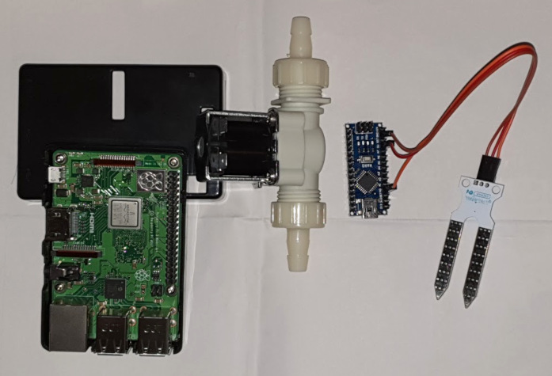

# watermator
This repo contains arduino and raspberry pi code for automatic flower watering system for indoor use. I have used io water valve to open and close the watering pipe and a simple soil moisture sensor to measure the moisture of the soil.

## Hardware
Hardware consists of:
* Rasberry pi 3B+
* Arduino nano
* Water valve, 8mm diameter
* Soil moisture sensor

## Software
### Arduino part
Arduino program reads measurements for moisture and forwards the measurements to iot controller program running on raspi via serial port. Arduino will also report the status for the water valve (open/close). Iot controller decides when the valve is opened or closed and arduino is also listening to the serial port for the commands for opening and closing the valve.

### Raspi part
Iot controller on the raspi checks messages from arduino and sends moisture measurement and valve status further to ThingSpeak and Eclipse MQTT service. Iot controller will also send warnings when moisture is too high or too low. When moisture level is below the watering threshold program will send command to arduino to open the valve for 3 seconds.
